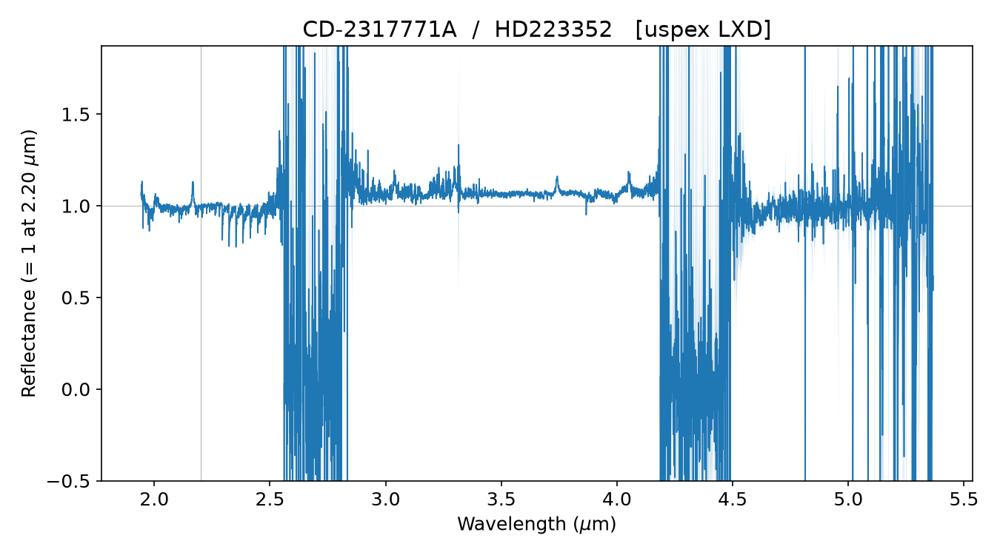

# Spectracular-NIR

*Formerly **SpexRock**. Part of the Spectracular family of small-body
reflectance pipelines — Spectracular-NIR (this repo, IRTF/SpeX
near-infrared) and Spectracular-VIS (LCO/FLOYDS visible, formerly
SpecReflect) — named with room for other wavelength ranges later. The
Python package keeps the import name ``spexrock`` so existing scripts
and configs keep working.*

**Asteroid reflectance spectra from NASA IRTF SpeX, end to end.**

SpexRock reduces raw SpeX frames — prism, SXD, or LXD mode, pre- or
post-upgrade instrument — to a normalized asteroid reflectance spectrum in
one command. It is a thin, batch-friendly pipeline built on
[pyspextool](https://github.com/pyspextool/pyspextool), the official Python
implementation of the Spextool reduction protocols (Cushing, Vacca & Rayner
2004), so every instrumental step follows the community-standard procedures
maintained by the instrument team. SpexRock adds the asteroid-specific
layer that Spextool leaves to the user:

* **Solar-analog telluric correction** — the object/analog ratio
  (pyspextool's `reflectance` mode, the Python descendant of
  `xtellcor_basic`) that removes the atmosphere and the solar spectrum in
  one division, with pyspextool's sub-pixel wavelength-shift optimization;
* **Normalized reflectance products** — unity at 1.20 µm (Bus-DeMeo
  convention) or any wavelength you choose, written as FITS + ASCII + CSV
  with full provenance (frame numbers, package versions, the exact config);
* **NEATM thermal-excess removal** (optional) — for LXD data beyond
  ~2.5 µm, the Harris (1998) model evaluated from your observing
  circumstances, with the beaming parameter either fixed or anchored so
  the corrected red end matches the continuum extrapolated from the K
  band (the Rivkin et al. 2022 convention);
* **One JSON config per reduction** — a `ReduceConfig` dataclass replaces
  the notebook top cell; the config used is snapshotted next to the
  products so any spectrum can be re-derived exactly.

## How it works

### Terminology used throughout

* **analog** — the solar-analog standard star observed alongside the
  asteroid. Always a G dwarf (never a giant: our side-by-side test showed
  a giant shifts the continuum slope by 0.05 µm⁻¹ while leaving band
  depths unchanged, so slope conclusions require dwarf analogs).
* **per-pair extraction vs. stacked extraction** — the two object
  branches. Per-pair: each A−B frame pair is extracted on its own and the
  resulting spectra are combined. Stacked: all pair-subtracted *images*
  are combined first and the single deep image is extracted once. "Stack"
  always refers to the image-domain combine; "combine" to the
  spectrum-domain one. Both use the same statistic (below).
* **the combine statistic** — everywhere frames or spectra are combined,
  pyspextool's default applies: a robust weighted mean with 8σ outlier
  clipping. This is deliberate photon economics: a median would cost
  ~22% in S/N for Gaussian noise (its variance is π/2 that of the mean),
  while the clipped weighted mean keeps the mean's efficiency and still
  rejects cosmic rays and bad frames.
* **telluric gap vs. advisory zones** — the gap (2.50–2.86 µm) is where
  the atmosphere is opaque; it is masked in every measurement and shaded
  dark in every figure. The advisory zones (1.82–1.94, 3.20–3.33,
  4.11–4.19 µm; derived as band-averaged ATRAN transmission < 0.5 at
  R = 350) are where the standard-star division is unreliable; they are
  masked in the band metrics and lab fits and shaded light in figures,
  but kept in the archived spectra.

### Pipeline stages

The pipeline runs the canonical Spextool sequence via pyspextool, then the
asteroid-specific steps:

1. **Calibrations** — master flat with order-edge tracing
   (`make_flat`), wavelength solution from argon arcs — supplemented by
   sky emission lines in LXD mode, where the argon lamp runs out of lines
   beyond ~4 µm (`make_wavecal`, `sky_files`).
2. **Extraction** — nonlinearity and bias corrections, A−B pair
   subtraction, flat fielding, spatial-profile-based aperture location and
   tracing, then sum extraction over the aperture with bad-pixel
   rejection, or profile-weighted ("optimal", Horne 1986) extraction when
   `psf_radius_arcsec` is set. Settings are identical for asteroid and
   analog, as required for the ratio to cancel instrument signatures.
   Before the object is extracted, a brightness gate measures the trace
   significance of the first raw A−B pair and warns if stacking is
   enabled on an unambiguously bright target (the silent-corruption
   case; see the bright-vs-faint rule below).
3. **Combination** — the extracted spectra are combined with the robust
   weighted mean (8σ clipping).
4. **Telluric correction / reflectance** — asteroid ÷ analog with
   `correction_type='reflectance'`; the airmass difference is checked and
   loudly warned about beyond a configurable threshold.
5. **Order merging** — for cross-dispersed modes, orders are scaled and
   merged on the telluric-corrected spectrum (prism skips this).
6. **Residual water correction** (optional, `water_correction="airmass"`)
   — the night's own measured optical depth τ(λ), regressed from the
   repeated analog visits, is applied at the object−analog airmass
   offset. Skips itself with a console note when the night has too few
   analog visits or too little airmass spread to support the regression.
7. **Normalization** — to unity at 1.20 µm (prism/SXD default) or 3.55 µm
   (LXD default), configurable.
8. **NEATM thermal-excess removal** (optional, off by default) — the
   modeled excess `E(λ) = F_thermal / F_reflected` is subtracted in
   reflectance units; requires `p_v`, `r`, `α`, and a beaming parameter
   η that is either fixed or fit (`neatm_fit_eta`): the fit adjusts η
   until the corrected reflectance in the reddest clean 0.1 µm of
   coverage matches a straight line extrapolated from the K band
   (2.0–2.45 µm). The anchor line is fit to the K band only — a region
   that is both thermal-free (for main-belt distances) and free of the
   3-µm band — so neither the thermal tail nor the absorption band can
   tilt it. Residual thermal flux can survive red-ward of the anchor
   window (it grows steeply with wavelength), which is why every band
   metric caps its fit range at 3.9 µm.
9. **QA summary plot** — the final spectrum with its uncertainty
   envelope, the modeled thermal excess when NEATM ran, and the telluric
   gap and advisory zones shaded. The y-range is computed from pixels
   outside the shaded zones, so in-zone noise on faint targets cannot
   flatten the plot.

Stages that already produced their outputs are skipped on rerun (`--fresh`
overrides), so a tweak to a late stage does not re-extract everything.
Multi-block extractions also resume at block granularity: frame-number
segments whose per-frame outputs already exist are skipped.

### Procedural details per stage

**Beam-position probe (before first extraction of a new night).** Nod
positions along the slit vary night to night, and automatic aperture
finding fails on faint targets and on junk orders. The documented recipe:
extract one A−B pair of the *analog* with automatic aperture finding,
read the ± peak positions from the output headers (`APOSO*` cards), and
set `aperture_find_method="fixed"`,
`aperture_find_parameter=[pos_A, pos_B]`, `aperture_signs=["+","-"]` in
the config. Signs are pinned because noisy profiles flip the automatic
sign inference on faint targets.

**Bright vs. faint targets (important robustness rule).** For targets
invisible in a single A−B pair, set `stack_object_images=True`: all
pair-subtracted frames are combined into one image (pyspextool's robust
weighted mean with 8σ clipping — statistically mean-efficient, unlike a
median) which is extracted once (`reduction_mode='A'` internally) — the
approach also used by Rivkin et al. (2022) and Arredondo et al. (2024).
For targets with a visible per-pair trace, leave stacking OFF: on a
bright, seeing/guiding-jittered trace the frame-to-frame variation at the
profile-core pixels dwarfs the propagated errors, so the 8σ clip REJECTS
the frames whose trace is centered on that pixel — clipping the core and
suppressing flux, worst in the thermal-background orders (we measured
artificial band-depth changes up to a factor ~2 on bright asteroids).
Per-pair extraction is immune because each frame is traced at its own
PSF position, so jitter never becomes a pixel-level outlier. When in
doubt, reduce both ways and compare.

**Optimal extraction: faint stacked objects only (photon economics with
a measured boundary).** Sum extraction (the default) adds every pixel in
the aperture with equal weight, so sky-dominated edge pixels dilute the
S/N. Setting `psf_radius_arcsec` (e.g. 2.0) switches the OBJECT to
profile-weighted "optimal" extraction (Horne 1986), which weights pixels
by the measured spatial profile. On our faintest archival stacked target
this raised the continuum and band-region S/N by ~40% — equivalent to
doubling the integration time — while leaving the measured band depth
and shape class unchanged.

The boundary matters as much as the gain. Optimal extraction's
assumptions hold only where photon noise dominates; on bright sources
the noise budget is profile systematics, and the weights then DISTORT
flux rather than optimize it. We measured this directly: optimally
extracting the (always-bright) analogs produced order-envelope-shaped
corruption of the reflectance, and optimally extracting a bright
per-pair object corrupted its band depth by several sigma even with the
analog correctly sum-extracted. A second boundary emerged
on adoption: even for stacked objects, optimal extraction destabilized
band depths on SHALLOW stacks (two nights with 16–20 combined pairs
shifted by 2.5–3σ), while deep stacks (≥ ~50 pairs) reproduced the sum
result exactly with the full S/N gain — a shallow stack's spatial
profile is too noisy to weight by. Policy, enforced by the code and the
configs: the analog is always sum-extracted (`analog_psf_radius_arcsec`,
default None, exists for experiments only); `psf_radius_arcsec` is set
only for faint objects with DEEP stacks, and only after the result is
verified stable against a sum reduction of the same night (the
before/after comparison is part of the adoption record). Bright
per-pair objects and shallow stacks use sum extraction; at their S/N
the photon argument is marginal and the accuracy risk is not.

The pipeline's brightness gate backs this rule up automatically: it
measures the narrow-trace significance of the first raw A−B pair
(strip-wise spatial profiles, high-passed to remove slit-wide sky
structure) and warns when stacking is enabled on a target scoring above
the bright threshold. The gate is deliberately one-sided — calibration
on real nights of both detector eras showed that bright targets can
score low (guiding smear, era-dependent frame structure), so a low score
proves nothing and triggers nothing; only the silent-corruption
direction (bright + stacking) warns. The config always stays
authoritative.

**LXD saturation knobs.** LXD sky frames commonly saturate the
longest-wavelength order; set `ignore_wavecal_saturation=True` (the
wavelength solution proceeds) and `exclude_orders="<N>"` to drop that
order from extraction. LXD wavelength calibration always needs sky frames
(the argon lamp has no lines beyond ~4 µm); by default the object frames
themselves are used (`sky_files=None`).

**File-name quirks.** `object_prefix` / `analog_prefix` override
`source_prefix` when the observer named object and analog files
differently; prefixes must include any separator (e.g. `"spc-"`,
`"objectname."`). Pre-upgrade (pre-2014) data use 4-digit frame numbers
and `instrument="spex"`.

**Residual water corrections (`spexrock/water.py`).** Beyond analog
division, two residual corrections are available: (1) *airmass
regression* — Beer–Lambert fit of ln(flux) vs airmass across the night's
repeated analog visits yields the night's measured optical-depth
spectrum τ(λ), applied as exp(τ·ΔAM) for the object−analog airmass
offset (model-free; preferred — in our tests it removes ~18% of
water-window residuals in a worst-case ΔAM=0.46 pair, vs ~3% for ATRAN
scaling); (2) *ATRAN power scaling* — division by a model transmission
T(λ)^x with x fitted on water-dominated windows. Fit residual corrections
on high-S/N spectra only (the analog), never on a noisy target, where
exponent fits chase noise.

The airmass regression is integrated into the pipeline via the config
knob `water_correction` (`"none"` default, or `"airmass"`): after order
merging and before normalization, τ(λ) is regressed from the night's
individually extracted analog frames (read back from `proc/` with
their header airmasses) and applied at ΔAM = ⟨AM_object⟩ − ⟨AM_analog⟩.
The step requires ≥ 3 analog frames spanning ≥ 0.05 in airmass and
skips itself with a console note otherwise, so enabling it is always
safe. Final products record the knob in `config_used.json` as usual.

**Band parameters (`spexrock/bands.py`).** Reported quantities follow the
3-µm literature: linear continuum from the clean 2.0–2.45 µm windows;
R(2.90) and R(3.05) continuum-normalized reflectances (Takir & Emery
2012 convention); band depth over 2.95–3.10 µm and at the smoothed
minimum; band center from a parabola fit around the minimum — flagged as
an *upper limit* when the minimum sits at the blue edge of the 2.86 µm
telluric cutoff (the ground-based signature of sharp-type/phyllosilicate
bands whose true center lies inside the atmospheric gap); FWHM and
integrated band area over the accessible window; bootstrap uncertainties
throughout. Both the telluric gap and the advisory zones are masked in
every metric (`bands.TELLURIC_GAP`, `bands.TELLURIC_ADVISORY`). The
3.20–3.33 µm zone matters most: it overlaps the band-center search
range, and telluric CH₄ artifacts there can pin a fitted center at
~3.2 µm (documented in the literature as well); a corollary is that
ground-based data cannot localize a band center inside 3.20–3.33 µm —
the ammonia-signature region — at ordinary S/N.

**Compositional fitting (`spexrock/labfit.py`).** Interpretation follows
standard curve-matching practice (Vernazza et al.; Brunetto et al.;
Reddy & Sanchez; Rivkin et al.; Fornasier et al.; Takir & Emery 2012,
Appendix C): select laboratory species plausibly present at the target's
surface temperature (phyllosilicates, carbonates, sulfates, opaques,
anhydrous silicates, carbonaceous-chondrite analogs, ammoniated species,
ices), and fit non-negative linear (areal) combinations of their
reflectance spectra to the observed spectrum, exhaustively ranking 1–3
component mixtures by reduced χ². Lab spectra are resampled and smoothed
to the data's resolution, and the telluric gap and advisory zones are
masked in the fit. The library combines RELAB room-temperature spectra
with SSHADE cryogenic endmembers (water-ice frost at 77–196 K, simulated
ice, ammoniated salts, and a 70–280 K carbonaceous-meteorite temperature
series), so volatile fitting uses temperature-appropriate spectra.
Because the fits are scale-free, an optional albedo-compatibility filter
(`search_mixtures(p_v=...)`) rejects mixtures whose areal 0.55-µm
reflectance is incompatible with the target's geometric albedo. Stated
caveats on every result: linear mixing gives areal (not mass) fractions
— intimate-mixing/Hapke modeling is out of scope; specimen and
preparation differences between facilities rival every other systematic
(quantified at high S/N: room-temperature preparations of a single
meteorite span as much χ² as a 70–280 K temperature sweep); grain size
modulates band contrast. The library-building script and index format
are documented in `data/lab_library/README.md`.

**Archival data.** The IRTF Legacy Archive serves raw FITS at
`irtfdata.ifa.hawaii.edu/idals/<sem>/data/scrs1/bigdog/<prog>/<yymmdd>/`,
searchable by object/date at `/search/`; semester schedules
(`/observing/schedule/cy<sem>_sched.txt`) map any date to program number
and PI — consult them (and the data's PI) before publishing archival
reductions.

## Install

```bash
cd SpexRock
python3.11 -m venv .venv
.venv/bin/pip install -e .
```

pyspextool downloads two large instrument calibration files from its public
S3 bucket on first use (cached in `~/Library/Caches/pyspextool`).

## Usage

```bash
spexrock-run --init my_asteroid.json   # write a template config
# edit the JSON: paths, frame numbers, analog star, mode...
spexrock-run my_asteroid.json          # reduce
spexrock-run my_asteroid.json --fresh  # full rerun, ignore intermediates
```

Or from the source tree without installing:

```bash
.venv/bin/python scripts/spexrock_run.py my_config.json
```

As a library:

```python
from spexrock import ReduceConfig
from spexrock.pipeline import run

config = ReduceConfig(
    object_name="1 Ceres", analog_name="HD 28099",
    instrument="uspex", mode="prism",
    raw_dir="raw/20260815", output_dir="spexrock_out/ceres",
    source_prefix="spc-", flat_prefix="flat-", arc_prefix="arc-",
    object_files="10-17", analog_files="20-23",
    flat_files="30-34", arc_files="35")
run(config)
```

The key config fields (see `spexrock/config.py` for all of them, with
comments):

| Field | Meaning |
| --- | --- |
| `instrument`, `mode` | `uspex`/`spex`; `prism`/`SXD`/`LXD` |
| `*_files` | pyspextool frame-number strings, e.g. `"23-24"`, `"1,3,5-9"` |
| `sky_files` | LXD only: sky frames for the long orders (default: the object frames themselves, standard IRTF practice) |
| `analog_sptype/bmag/vmag` | optional; set all three to skip the SIMBAD query |
| `normalization_wavelength_um` | default 1.20 (prism/SXD) or 3.55 (LXD) |
| `psf_radius_arcsec` | set (e.g. 2.0) for optimal extraction of the OBJECT — faint stacked targets only (~40% S/N gain measured); analogs always sum-extract |
| `water_correction` | `"none"` or `"airmass"` (the night's own τ(λ) from repeated analog visits) |
| `neatm_*` | thermal-excess removal; needs `p_v`, `r_au`, `alpha_deg`; `neatm_fit_eta` anchors η to the K-band continuum |

## Worked example

The repository reduces the pyspextool sample data end to end (a star pair,
so the "reflectance" is a stellar flux ratio — flat-ish, which is exactly
what makes it a good pipeline check):

```bash
git clone https://github.com/pyspextool/test_data data/sample/test_data
.venv/bin/python -m pytest tests/test_spexrock.py -m slow -v
```



## Package layout

```
spexrock/
  config.py     ReduceConfig — the one dataclass that defines a reduction
  engine.py     pyspextool call sequence (setup, cals, extract, combine)
  telluric.py   solar-analog division (reflectance mode) + airmass check
  merging.py    order merging for cross-dispersed modes
  products.py   normalization, thermal correction, FITS/ASCII/CSV writers
  thermal.py    NEATM: subsolar temperature, disk integral, excess removal
  water.py      residual telluric-water corrections (airmass regression, ATRAN)
  bands.py      formal 3-um band parameters (continuum, center, depth, width)
  labfit.py     lab-spectra mixture fitting (NNLS curve matching, RELAB library)
  qa.py         final-spectrum summary plot (pyspextool writes per-stage QA)
  pipeline.py   orchestrator with resume-from-stage
  cli/run.py    spexrock-run
scripts/        source-tree shims
tests/          test_spexrock.py (fast unit tests + slow end-to-end)
```

## Tests

```bash
.venv/bin/python -m pytest tests/test_spexrock.py -m "not slow"   # fast, no data
.venv/bin/python -m pytest tests/test_spexrock.py -m slow         # sample reduction
```

## Scope and limitations

* The analog is assumed to be a good solar match; no color correction is
  applied for non-G2V analogs (the standard caveat for this method).
* NEATM excess removal assumes the geometric albedo at the normalization
  wavelength approximates `p_v`; the default solar spectrum is a 5772 K
  Planck curve scaled to the solar constant (good to a few percent in the
  2–5 µm continuum; supply `solar_spectrum_file` for better).
* Renaming the package: the name lives only in the `spexrock/` directory
  name, `pyproject.toml`, and `PACKAGE_NAME` in `spexrock/__init__.py`.

## References

* Cushing, M. C., Vacca, W. D., & Rayner, J. T. 2004, PASP, 116, 362 — Spextool
* Vacca, W. D., Cushing, M. C., & Rayner, J. T. 2003, PASP, 115, 389 — telluric method
* Rayner, J. T., et al. 2003, PASP, 115, 362 — the SpeX instrument
* Harris, A. W. 1998, Icarus, 131, 291 — NEATM
* DeMeo, F. E., et al. 2009, Icarus, 202, 160 — 1.2 µm normalization convention
* [pyspextool](https://github.com/pyspextool/pyspextool) — the reduction engine

*Additional method references:* Vernazza, P., et al. 2015, ApJ 806, 204 & 2017, AJ 153, 72 — compositional curve matching · Reddy, V., & Sanchez, J. A., et al., Asteroids IV spectral-analysis chapter · Fornasier, S., et al. 2014, Icarus 233, 163 · Brunetto, R., et al. — laboratory analog spectra · Smette, A., et al. 2015, A&A 576, A77 (Molecfit) · Ulmer-Moll, S., et al. 2019, A&A 621, A79 (telluric-method comparison)
